# FGVD Vehicle Classification — Multi-method Benchmarks

Implementation suite extending the SGCN paper *Graph-Based Two-Three Wheeler Classification in Unconstrained Indian Roads* (ITSC 2024) to **all vehicle classes** (2W + 3W + 4W) at three label levels:

- **L1** — vehicle type (motorcycle / scooter / autorickshaw / car / bus / mini-bus / truck) — 7 classes
- **L2** — manufacturer (Honda / Hero / Maruti / …) — 39 classes
- **L3** — model (Activa / Splendor / City / …) — 200 classes

The paper is replicated with raw RGB+Gabor+Sobel features. We additionally evaluate Random Forest, GAT, an MLP CNN baseline, and a deep-feature SGCN variant, all sharing the same data pipeline via `fgvd_utils.py`.

---

## Pipeline overview

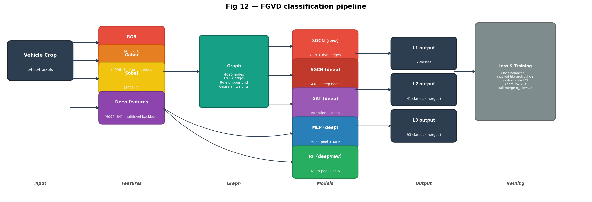

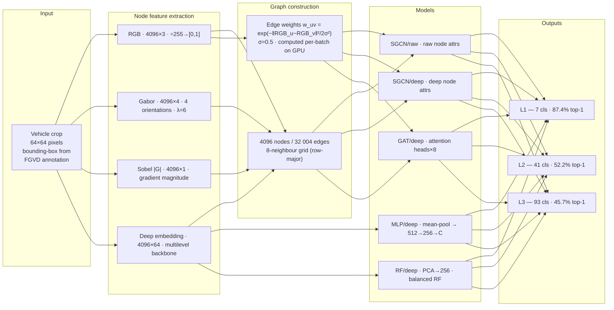
```mermaid
flowchart LR
    subgraph INPUT["Input"]
        A["Vehicle crop\n64×64 pixels\nbounding-box from\nFGVD annotation"]
    end
    subgraph FEATS["Node feature extraction"]
        B1["RGB · 4096×3 · ÷255→[0,1]"]
        B2["Gabor · 4096×4 · 4 orientations · λ=6"]
        B3["Sobel |G| · 4096×1 · gradient magnitude"]
        B4["Deep embedding · 4096×64 · multilevel backbone"]
    end
    subgraph GRAPH["Graph construction"]
        C["4096 nodes / 32 004 edges\n8-neighbour grid (row-major)"]
        D["Edge weights w_uv = exp(−‖RGB_u−RGB_v‖²/2σ²)\nσ=0.5 · computed per-batch on GPU"]
    end
    subgraph MODELS["Models"]
        E1["SGCN/raw · raw node attrs"]
        E2["SGCN/deep · deep node attrs"]
        E3["GAT/deep · attention heads×8"]
        E4["MLP/deep · mean-pool → 512→256→C"]
        E5["RF/deep · PCA→256 · balanced RF"]
    end
    subgraph OUTPUT["Outputs"]
        F1["L1 — 7 cls · 87.4% top-1"]
        F2["L2 — 41 cls · 52.2% top-1"]
        F3["L3 — 93 cls · 45.7% top-1"]
    end
    A --> B1 & B2 & B3 & B4
    B1 & B2 & B3 & B4 --> C
    B1 --> D
    C & D --> E1 & E2 & E3
    B4 --> E4 & E5
    E1 & E2 & E3 & E4 & E5 --> F1 & F2 & F3
```

---

## Vehicle crops & node features

Each vehicle bounding box is resized to 64×64 pixels. Every pixel becomes one **graph node**; its feature vector is the stacked RGB / Gabor / Sobel values (or the deep embedding).

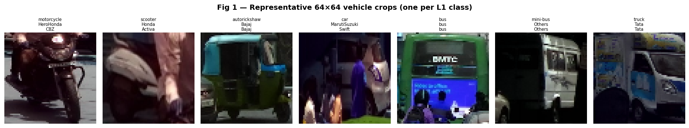

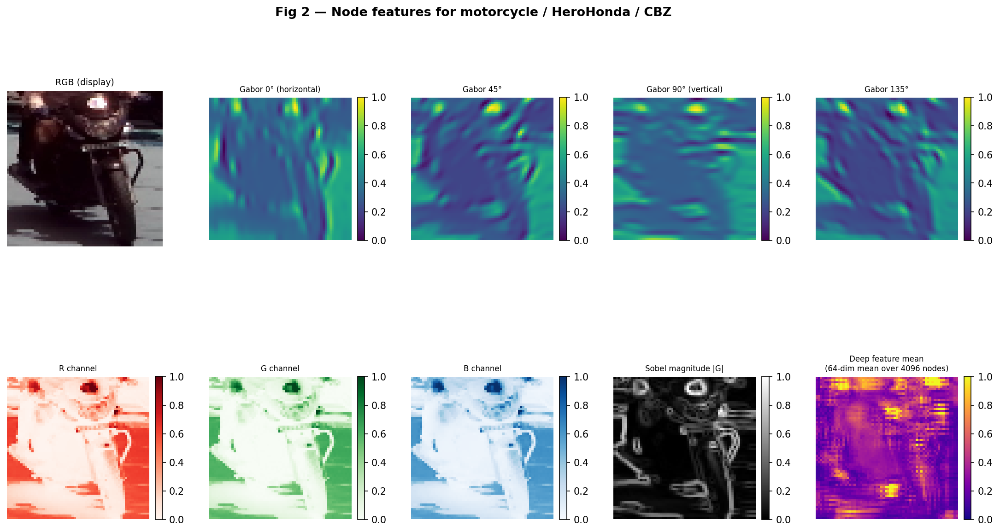

---

## Graph structure & edge weights

### Graph overlay on actual crops

Each node sits at one pixel; edge colour/width shows how similar two neighbouring pixels are. Green = smooth region, red = boundary.

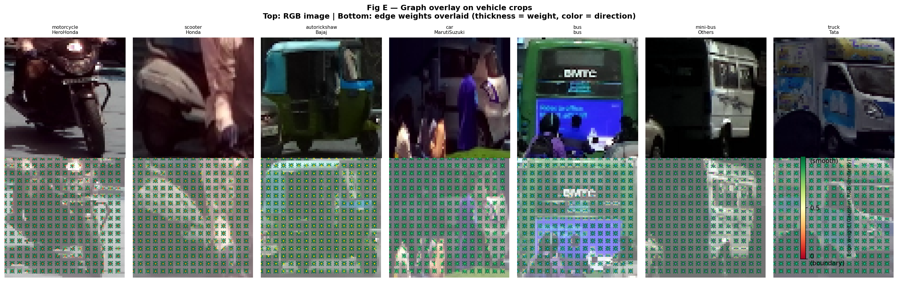

### 8-neighbour connectivity

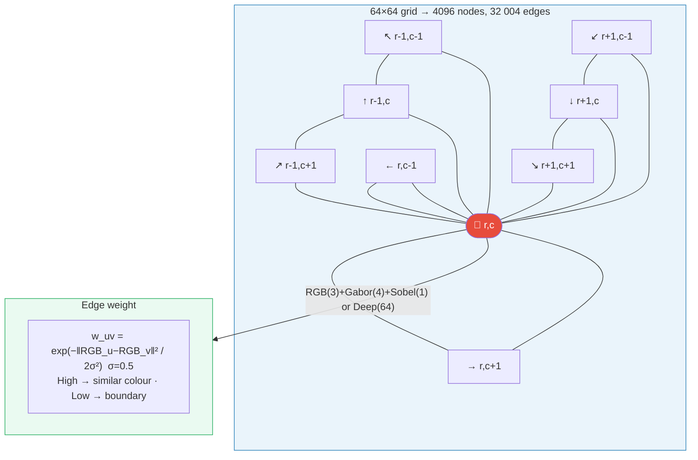
```mermaid
graph TD
    subgraph GRID["64×64 grid → 4096 nodes, 32 004 edges"]
        NW["↖ r-1,c-1"] --- N["↑ r-1,c"] --- NE["↗ r-1,c+1"]
        W["← r,c-1"]   --- P(["📍 r,c"])  --- E["→ r,c+1"]
        SW["↙ r+1,c-1"] --- S["↓ r+1,c"] --- SE["↘ r+1,c+1"]
        NW --- P
        NE --- P
        SW --- P
        SE --- P
        N  --- P
        S  --- P
        W  --- P
        E  --- P
    end
    subgraph WEIGHT["Edge weight"]
        WF["w_uv = exp(−‖RGB_u−RGB_v‖² / 2σ²)  σ=0.5\nHigh → similar colour · Low → boundary"]
    end
    P -->|"RGB(3)+Gabor(4)+Sobel(1) or Deep(64)"| WEIGHT
    style P fill:#e74c3c,color:#fff
    style GRID fill:#eaf4fb,stroke:#2980b9
    style WEIGHT fill:#eafaf1,stroke:#27ae60
```

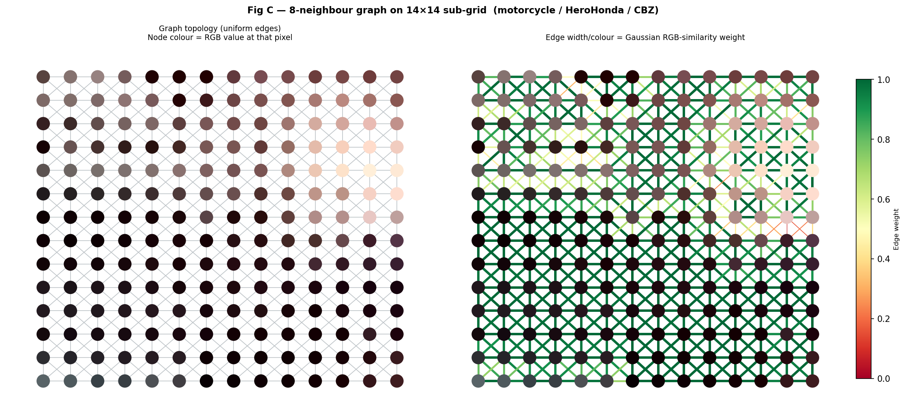

*Left: uniform connectivity — node colour = pixel RGB. Right: edge width and colour = Gaussian RGB-similarity weight (green = high, red = low).*

### Edge weight heatmaps

Edge weights are computed dynamically on the GPU every forward pass — no pre-baked adjacency file is read. Each row shows one vehicle; columns show mean weight for horizontal, vertical, and diagonal edge directions separately.

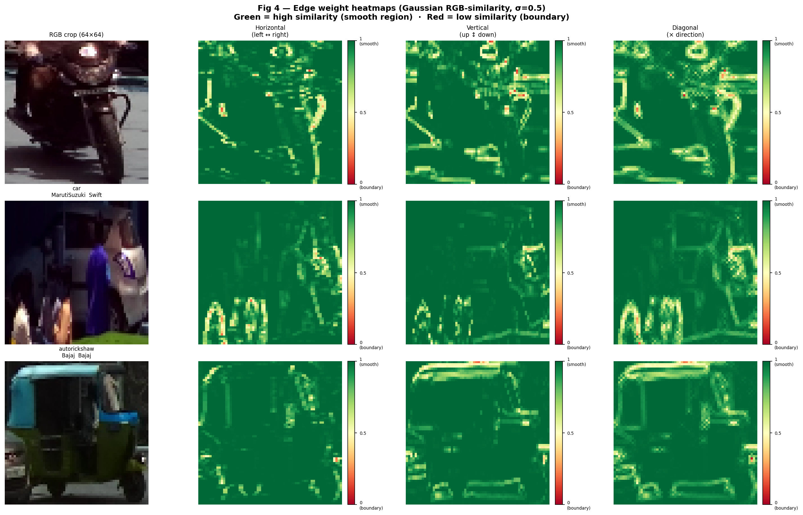

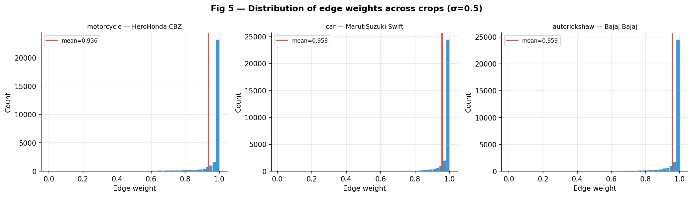

### σ sensitivity — how the Gaussian kernel parameter affects connectivity

Small σ connects only near-identical pixels (tight boundaries). Large σ makes all edges nearly equal weight (loses boundary signal). σ=0.5 balances boundary sharpness against noise.

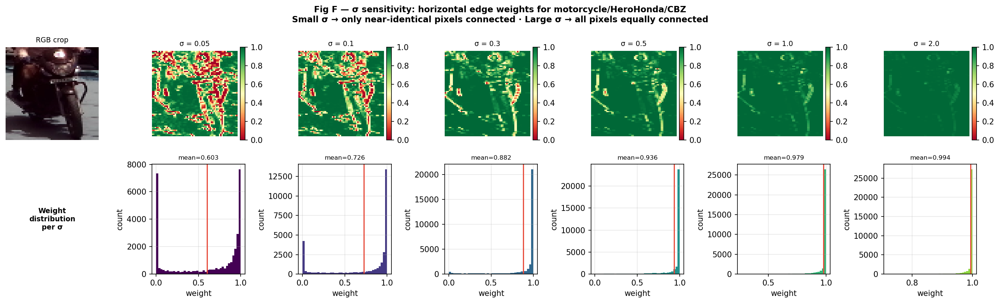

---

## Label hierarchy

### L1 → L2 → L3 taxonomy

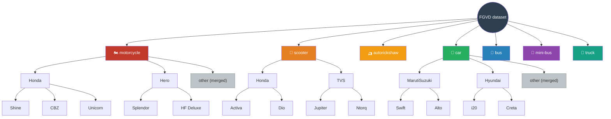
```mermaid
graph TD
    ROOT(("FGVD dataset"))
    L1_MC["🏍 motorcycle"] & L1_SC["🛵 scooter"] & L1_AR["🛺 autorickshaw"]
    L1_CA["🚗 car"] & L1_BU["🚌 bus"] & L1_MB["🚐 mini-bus"] & L1_TR["🚛 truck"]
    ROOT --> L1_MC & L1_SC & L1_AR & L1_CA & L1_BU & L1_MB & L1_TR
    L1_MC --> MC_HO["Honda"] --> MC_HO_SH["Shine"] & MC_HO_CB["CBZ"] & MC_HO_UN["Unicorn"]
    L1_MC --> MC_HE["Hero"]  --> MC_HE_SP["Splendor"] & MC_HE_HF["HF Deluxe"]
    L1_MC --> MC_OT["other (merged)"]
    L1_SC --> SC_HO["Honda"] --> SC_HO_AC["Activa"] & SC_HO_DI["Dio"]
    L1_SC --> SC_TV["TVS"]   --> SC_TV_JU["Jupiter"] & SC_TV_NT["Ntorq"]
    L1_CA --> CA_MS["MarutiSuzuki"] --> CA_MS_SW["Swift"] & CA_MS_AL["Alto"]
    L1_CA --> CA_HY["Hyundai"]      --> CA_HY_I2["i20"] & CA_HY_CR["Creta"]
    L1_CA --> CA_OT["other (merged)"]
    style ROOT fill:#2c3e50,color:#fff
    style L1_MC fill:#c0392b,color:#fff
    style L1_SC fill:#e67e22,color:#fff
    style L1_AR fill:#f39c12,color:#fff
    style L1_CA fill:#27ae60,color:#fff
    style L1_BU fill:#2980b9,color:#fff
    style L1_MB fill:#8e44ad,color:#fff
    style L1_TR fill:#16a085,color:#fff
    style MC_OT fill:#bdc3c7,stroke:#7f8c8d
    style CA_OT fill:#bdc3c7,stroke:#7f8c8d
```

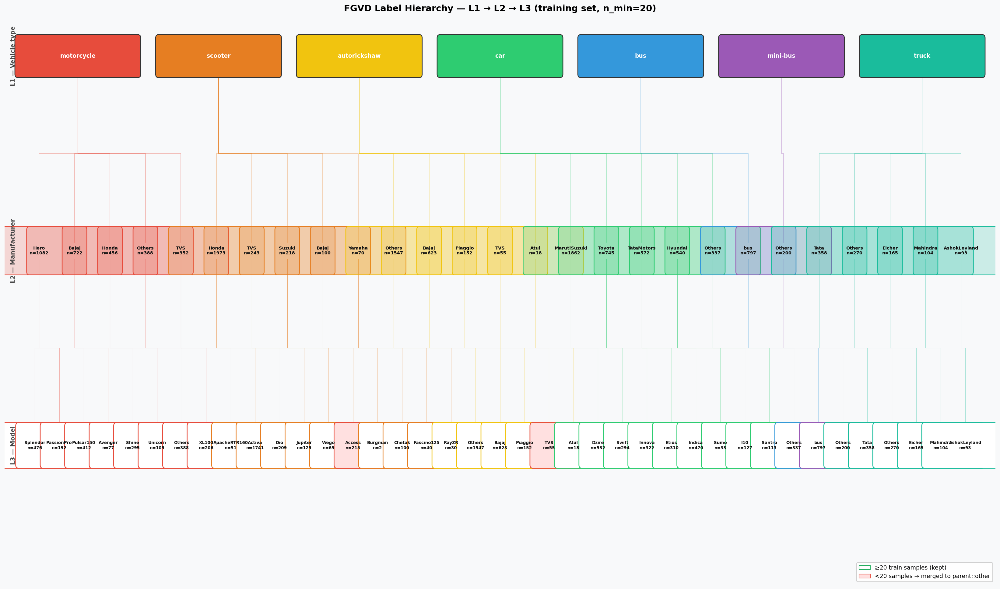

*White boxes: ≥20 train samples (kept). Pink boxes: <20 samples → merged to `<parent>::other`.*

### Long-tail class distribution

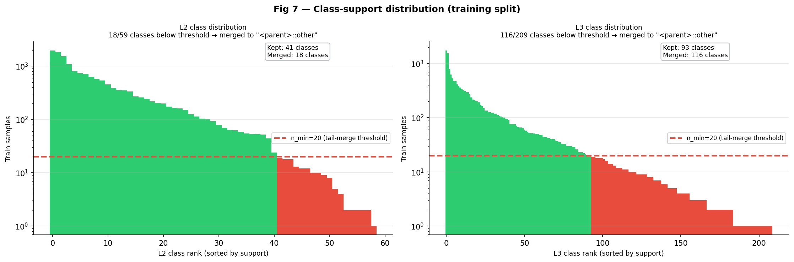

### Tail-merge & hierarchical loss

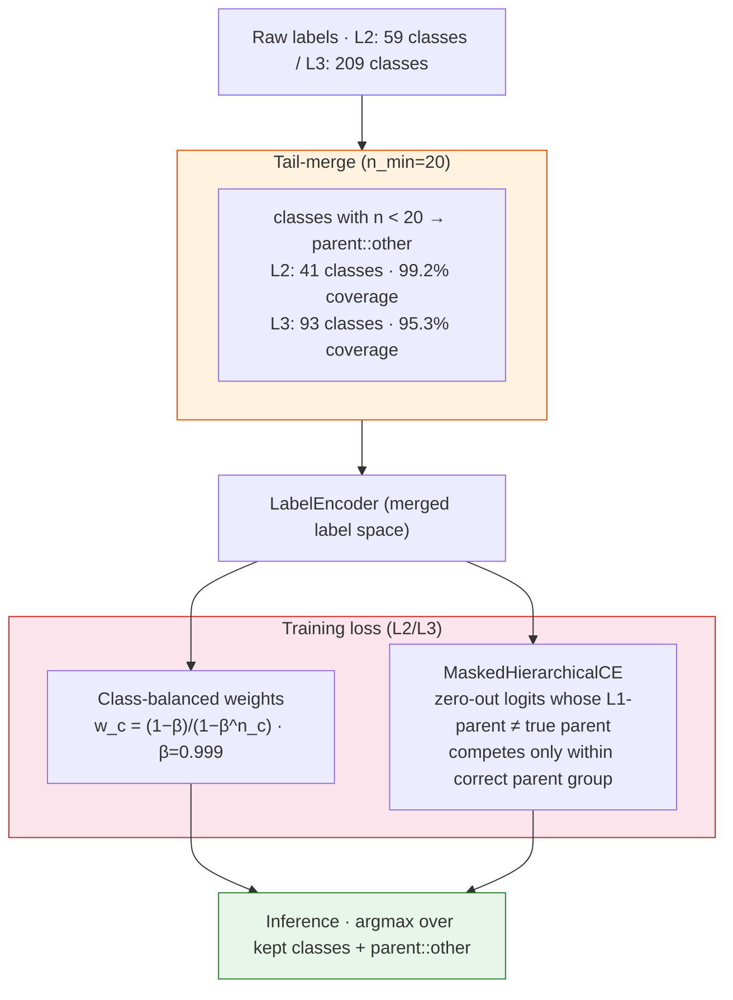
```mermaid
flowchart TD
    RAW["Raw labels · L2: 59 classes / L3: 209 classes"]
    subgraph TAIL["Tail-merge (n_min=20)"]
        TM["classes with n < 20 → parent::other\nL2: 41 classes · 99.2% coverage\nL3: 93 classes · 95.3% coverage"]
    end
    LE["LabelEncoder (merged label space)"]
    subgraph LOSS["Training loss (L2/L3)"]
        CB["Class-balanced weights\nw_c = (1−β)/(1−β^n_c) · β=0.999"]
        MC["MaskedHierarchicalCE\nzero-out logits whose L1-parent ≠ true parent\ncompetes only within correct parent group"]
    end
    PRED["Inference · argmax over kept classes + parent::other"]
    RAW --> TAIL --> LE --> CB & MC --> PRED
    style TAIL fill:#fff3e0,stroke:#e65100
    style LOSS fill:#fce4ec,stroke:#c62828
    style PRED fill:#e8f5e9,stroke:#2e7d32
```

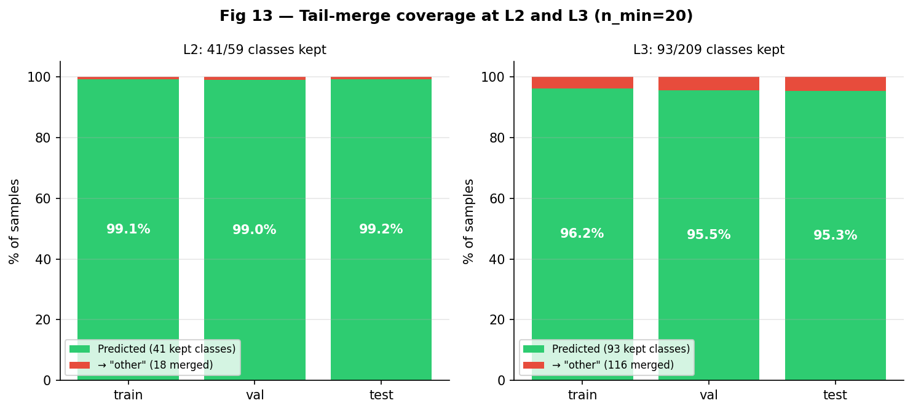

---

## Node feature analysis

### Raw vs deep feature statistics

The deep backbone produces 64-dim embeddings. Below: per-channel means and variance of raw features, deep feature variance by dimension, and inter-dimension correlation.

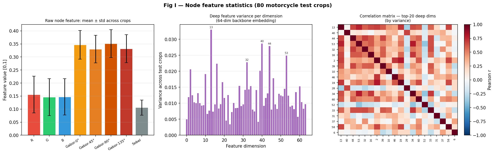

### Deep feature space (PCA)

PCA of mean-pooled deep embeddings coloured by L1 class. The classes separate well in PC1–PC2, explaining why all deep-feature methods significantly outperform raw features.

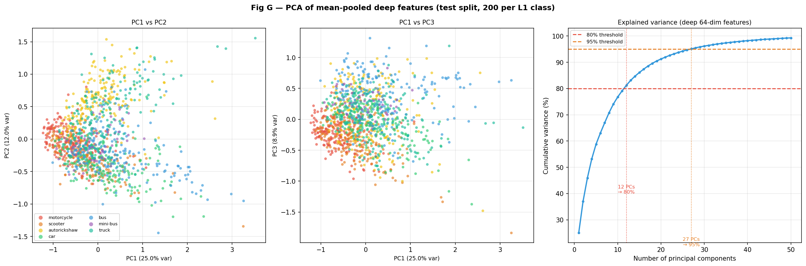

---

## Model architectures

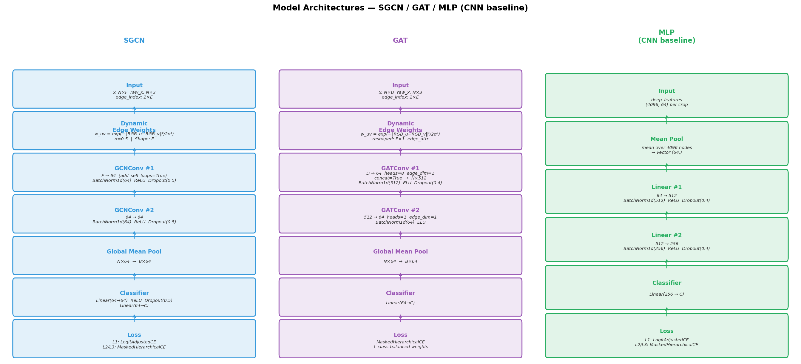

### SGCN

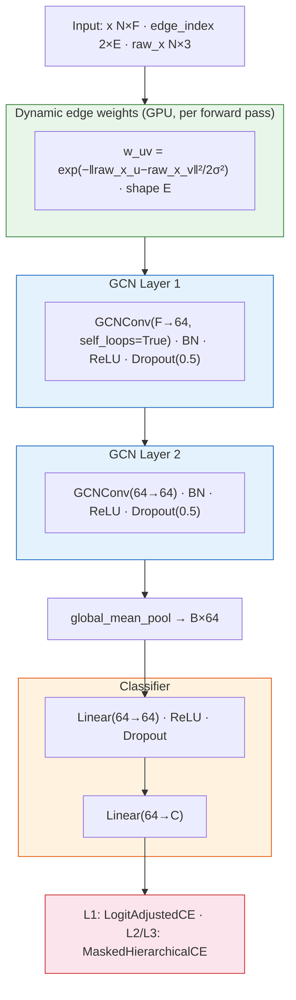
```mermaid
flowchart TD
    IN["Input: x N×F · edge_index 2×E · raw_x N×3"]
    subgraph EDGES["Dynamic edge weights (GPU, per forward pass)"]
        EW["w_uv = exp(−‖raw_x_u−raw_x_v‖²/2σ²) · shape E"]
    end
    subgraph GCN1["GCN Layer 1"]
        G1["GCNConv(F→64, self_loops=True) · BN · ReLU · Dropout(0.5)"]
    end
    subgraph GCN2["GCN Layer 2"]
        G2["GCNConv(64→64) · BN · ReLU · Dropout(0.5)"]
    end
    POOL["global_mean_pool → B×64"]
    subgraph HEAD["Classifier"]
        H1["Linear(64→64) · ReLU · Dropout"]
        H2["Linear(64→C)"]
    end
    LOSS["L1: LogitAdjustedCE · L2/L3: MaskedHierarchicalCE"]
    IN --> EDGES --> GCN1 --> GCN2 --> POOL --> H1 --> H2 --> LOSS
    style EDGES fill:#e8f5e9,stroke:#2e7d32
    style GCN1 fill:#e3f2fd,stroke:#1565c0
    style GCN2 fill:#e3f2fd,stroke:#1565c0
    style HEAD fill:#fff3e0,stroke:#e65100
    style LOSS fill:#fce4ec,stroke:#c62828
```

### GAT

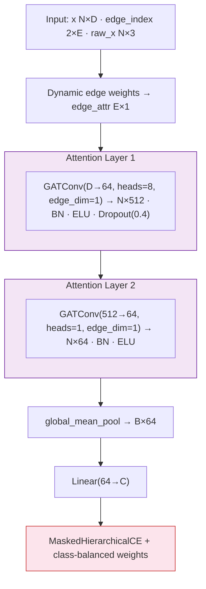
```mermaid
flowchart TD
    IN["Input: x N×D · edge_index 2×E · raw_x N×3"]
    EW["Dynamic edge weights → edge_attr E×1"]
    subgraph ATT1["Attention Layer 1"]
        A1["GATConv(D→64, heads=8, edge_dim=1) → N×512 · BN · ELU · Dropout(0.4)"]
    end
    subgraph ATT2["Attention Layer 2"]
        A2["GATConv(512→64, heads=1, edge_dim=1) → N×64 · BN · ELU"]
    end
    POOL["global_mean_pool → B×64"]
    CLS["Linear(64→C)"]
    LOSS["MaskedHierarchicalCE + class-balanced weights"]
    IN --> EW --> ATT1 --> ATT2 --> POOL --> CLS --> LOSS
    style ATT1 fill:#f3e5f5,stroke:#6a1b9a
    style ATT2 fill:#f3e5f5,stroke:#6a1b9a
    style LOSS fill:#fce4ec,stroke:#c62828
```

### Experiment matrix

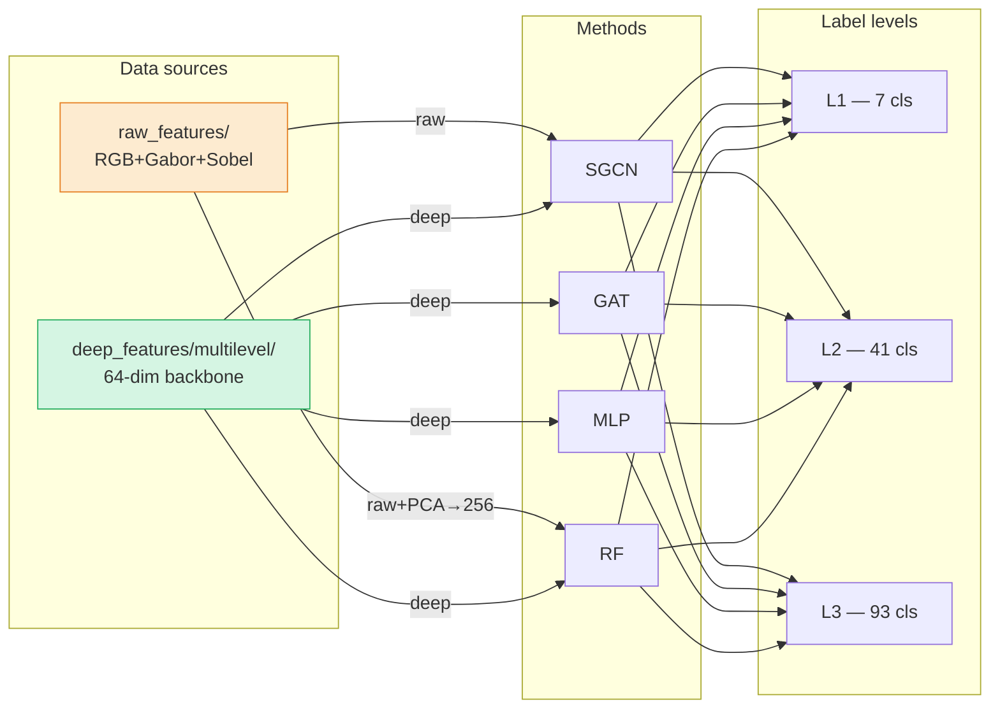
```mermaid
flowchart LR
    subgraph DATA["Data sources"]
        D1["raw_features/\nRGB+Gabor+Sobel"]
        D2["deep_features/multilevel/\n64-dim backbone"]
    end
    subgraph METHODS["Methods"]
        M1["SGCN"] & M2["GAT"] & M3["MLP"] & M4["RF"]
    end
    subgraph LEVELS["Label levels"]
        LV1["L1 — 7 cls"] & LV2["L2 — 41 cls"] & LV3["L3 — 93 cls"]
    end
    D1 -->|raw| M1
    D1 -->|raw+PCA→256| M4
    D2 -->|deep| M1 & M2 & M3 & M4
    M1 & M2 & M3 & M4 --> LV1 & LV2 & LV3
    style D1 fill:#fdebd0,stroke:#e67e22
    style D2 fill:#d5f5e3,stroke:#27ae60
```

---

## Experimental results

All numbers on the held-out **test split** (4,890–4,891 samples). L2/L3 use tail-merging at `n_min=20`. The paper baseline (Table V) covers **2W+3W only** (3 L1 classes) — not directly comparable to our 7-class L1.

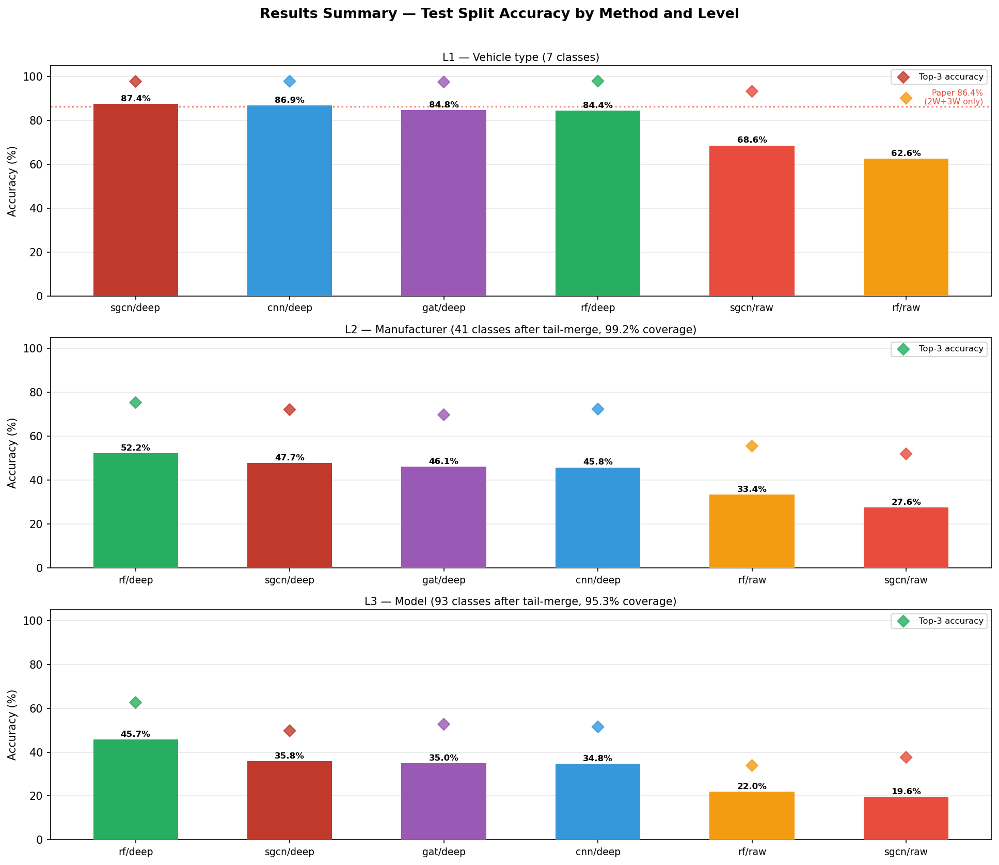

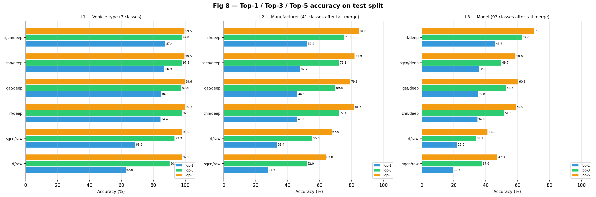

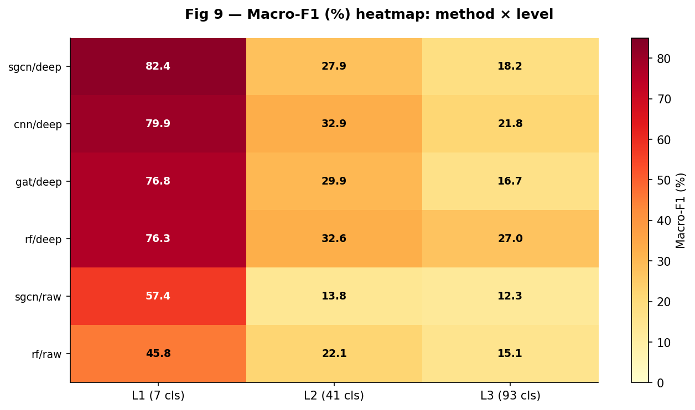

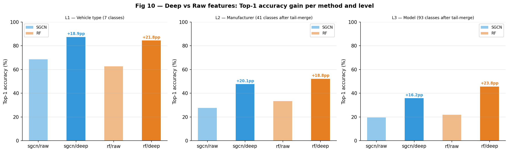

### L1 — vehicle type (7 classes)

| Method | Features | Top-1 | Top-3 | Top-5 | Macro-F1 | Wtd-F1 |
|---|---|---|---|---|---|---|
| **SGCN** | **deep** | **87.44%** | 97.77% | 99.47% | **82.35%** | 87.54% |
| CNN (MLP) | deep | 86.85% | 97.83% | 99.49% | 79.89% | 86.80% |
| GAT | deep | 84.79% | 97.51% | 99.57% | 76.77% | 84.72% |
| RF | deep | 84.42% | 97.91% | 99.73% | 76.25% | 84.03% |
| SGCN | raw | 68.55% | 93.25% | 97.96% | 57.44% | 67.06% |
| RF | raw (PCA→256) | 62.58% | 90.15% | 97.85% | 45.75% | 58.52% |
| *Paper (SGCN, 2W+3W only)* | *raw* | *86.37%* | — | — | — | — |

### L2 — manufacturer (41 classes after tail-merge · 99.2% test coverage)

| Method | Features | Top-1 | Top-3 | Top-5 | Macro-F1 | Wtd-F1 |
|---|---|---|---|---|---|---|
| **RF** | **deep** | **52.23%** | 75.34% | 84.62% | **32.55%** | **47.88%** |
| SGCN | deep | 47.73% | 72.15% | 81.94% | 27.86% | 44.36% |
| GAT | deep | 46.07% | 69.80% | 79.30% | 29.91% | 43.49% |
| CNN (MLP) | deep | 45.81% | 72.37% | 81.57% | 32.94% | 47.18% |
| RF | raw (PCA→256) | 33.41% | 55.53% | 67.51% | 22.08% | 30.25% |
| SGCN | raw | 27.60% | 51.97% | 63.77% | 13.83% | 24.71% |
| *Paper (2W+3W only)* | *raw* | *71.89%* | — | — | — | — |

### L3 — model (93 classes after tail-merge · 95.3% test coverage)

| Method | Features | Top-1 | Top-3 | Top-5 | Macro-F1 | Wtd-F1 |
|---|---|---|---|---|---|---|
| **RF** | **deep** | **45.73%** | 62.60% | 70.35% | **27.00%** | **42.48%** |
| SGCN | deep | 35.79% | 49.73% | 58.61% | 18.20% | 35.85% |
| GAT | deep | 35.01% | 52.70% | 60.31% | 16.74% | 34.92% |
| CNN (MLP) | deep | 34.79% | 51.49% | 58.99% | 21.77% | 37.42% |
| RF | raw (PCA→256) | 21.96% | 33.90% | 41.14% | 15.09% | 20.98% |
| SGCN | raw | 19.59% | 37.64% | 47.25% | 12.31% | 20.28% |
| *Paper (2W+3W only)* | *raw* | *49.87%* | — | — | — | — |

### Multi-metric radar chart (deep-feature methods only)

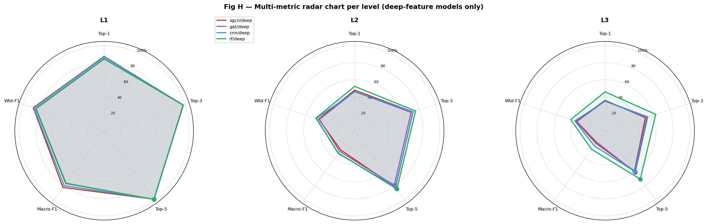

### Learning curves

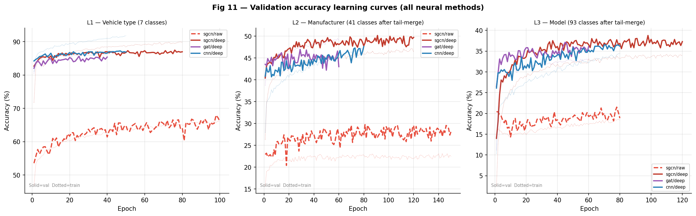

### Key findings

1. **Deep features dominate.** Every deep-feature model comfortably beats its raw-feature counterpart. The multilevel backbone (trained with L1/L2/L3 supervision) encodes brand/model structure that handcrafted RGB+Gabor+Sobel cannot capture.

2. **Graph structure helps at L1, not at L2/L3.** SGCN-deep is the best L1 model (87.4%), but Random Forest on pooled deep features wins L2 (52.2%) and L3 (45.7%). Spatial message-passing aggregates local texture for coarse type discrimination effectively; fine-grained brand/model differences reside in the deep vector itself — averaging over neighbours dilutes it.

3. **CNN baseline (no graph) is competitive.** The simple MLP over mean-pooled deep features reaches 86.9% at L1, within 0.6 pp of the best model, confirming the graph adds modest but real value at L1 only.

4. **Long-tail is the L2/L3 ceiling.** After tail-merging, top-3 at L2 reaches 75% (RF-deep) — the ranked list is useful even when top-1 errs. L3 top-3 at 62.6% is reasonable given 93 classes.

5. **Adjacency bug in original SGCN mattered.** The shared `master_grid_adj.npz` produced L2 plateau at 32% val_acc. With dynamic Gaussian weights, SGCN-raw L2 reaches 27.6% — confirming the bottleneck was always features, not the graph computation.

---

## Repository layout

```
fgvd_utils.py       # all shared logic (data, models, losses, training, metrics)
sgcn.ipynb          # paper SGCN — raw features, dynamic Gaussian edge weights
sgcn_df.ipynb       # SGCN — multilevel deep features
rf.ipynb            # Random Forest — raw (PCA→256) and deep features
gat.ipynb           # GAT — deep features, dynamic edge weights
cnn.ipynb           # MLP over mean-pooled deep features (sanity baseline)
results.ipynb       # cross-method comparison table + plots
visuals.ipynb       # all research figures (runs visuals/ directory)

FGVD_Graph_Handover/
    metadata.csv
    raw_features/{rgb,gabor,sobel}/{train,val,test}/<vehicle_id>.npy
    deep_features/multilevel/{train,val,test}/<vehicle_id>.npy
    master_grid_skeleton.npz          # 8-neighbour connectivity (preferred)
    master_grid_adj.npz               # legacy fallback (connectivity only, weights ignored)
    README.md                         # data-format reference

checkpoints/{method}/{features}/{level}_{case}/   # best.pt, last.pt, metrics.json
plots/{method}/{features}/{level}_{case}_curves.png
results/comparison_table.csv
visuals/                              # all 17 research figures
```

`{method}` ∈ `{sgcn, gat, rf, cnn}` · `{features}` ∈ `{raw, deep}` · `{level}` ∈ `{L1, L2, L3}`.

---

## Why this departs from the paper

| Aspect | Paper | This repo |
|---|---|---|
| Vehicle scope | 2W + 3W only | 2W + 3W + 4W (full FGVD) |
| L1 classes | 3 | 7 |
| L2 classes | ~10 | 39 |
| L3 classes | ~30 | 200 |
| SGCN edge weights | Dynamic Gaussian per crop | Same — recomputed on GPU per batch |
| Long-tail handling | None reported | Tail-merge + class-balanced loss for L2/L3 |
| Reported metrics | Top-1 accuracy | Top-1 + Top-3 + Top-5 + Macro/Wtd-F1 + coverage |

---

## Setup

```bash
python -m venv .venv && source .venv/bin/activate
pip install -r requirements.txt
# Install PyG companion wheels matching your torch+CUDA version:
pip install torch-scatter torch-sparse torch-cluster torch-spline-conv \
  -f https://data.pyg.org/whl/torch-2.5.0+cu118.html
```

---

## Running experiments

```python
from fgvd_utils import ExperimentConfig, run_experiment
cfg = ExperimentConfig(method='gat', level='L2', feature_source='deep', epochs=60)
out = run_experiment(cfg)
```

`run_experiment` auto-enables tail-merge + class-balanced loss for L2/L3 and saves checkpoints + curve PNG. All notebooks support resume.

| Day | Notebook | Wall time |
|---|---|---|
| 1 | `cnn.ipynb`, `rf.ipynb` (deep) | <1 h |
| 1 | `rf.ipynb` (raw, PCA) | 1–2 h |
| 2 | `gat.ipynb` | 4–6 h |
| 3 | `sgcn.ipynb` | 4–6 h |
| 4 | `sgcn_df.ipynb` | 4–6 h |
| 5 | `results.ipynb`, `visuals.ipynb` | 15 min |

---

## Graph visualisation tools

| Tool | Best for |
|---|---|
| **[draw.io](https://app.diagrams.net)** | Architecture & flow diagrams — free, web-based, export PNG/SVG |
| **[Gephi](https://gephi.org)** | Large network exploration (4096+ nodes) — force-directed, free desktop |
| **[yEd](https://www.yworks.com/products/yed)** | Hierarchical & grid auto-layouts — free desktop, GraphML import |
| **[Cytoscape](https://cytoscape.org)** | Bio-style label hierarchy trees — free desktop |
| **NetworkX + matplotlib** | Static graph figures in Python — used in `visuals.ipynb` |
| **Pyvis** | Interactive HTML graph from Python — `pip install pyvis` |
| **Graphviz** | DOT-language hierarchical trees — `pip install graphviz` |

---

## Methodology notes

### Adjacency / edge weights
Edge weights `exp(-||RGB_u - RGB_v||² / 2σ²)` are computed **dynamically on the GPU per batch** for all graph models. The pre-baked `master_grid_adj.npz` and `per_sample_adj/` files are not used at training time.

### Tail merging
Classes with `train_count < n_min=20` are merged into `"<parent>::other"`. Coverage is reported in every `metrics.json`.

### Class imbalance
Class-balanced weights (Cui et al., CVPR'19): `w_c = (1−β)/(1−β^n_c)`, β=0.999. Logit-adjusted CE (Menon et al., ICLR'21) available via `use_logit_adjustment=True`.

---

## Troubleshooting

- **PyG warns about `torch_scatter`/`torch_sparse`** — CUDA version mismatch; falls back gracefully.
- **OOM on raw RF** — PCA→256 applied automatically; lower `rf_pca_dim` if needed.
- **`master_grid_skeleton.npz` not found** — falls back to `master_grid_adj.npz` connectivity.
- **Resume refuses checkpoint** — label space changed; delete `last.pt` and rerun.

---

## Reference

Original paper: *Graph-Based Two-Three Wheeler Classification in Unconstrained Indian Roads* — see [PDF](Graph-Based_Two-Three_Wheeler_Classification_in_Unconstrained_Indian_Roads.pdf).
