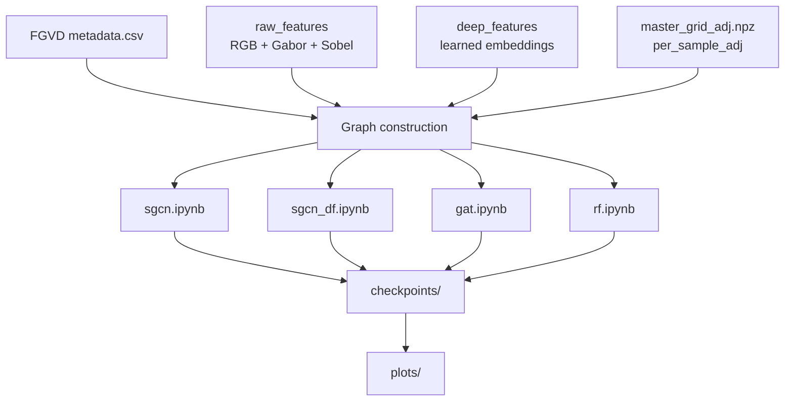
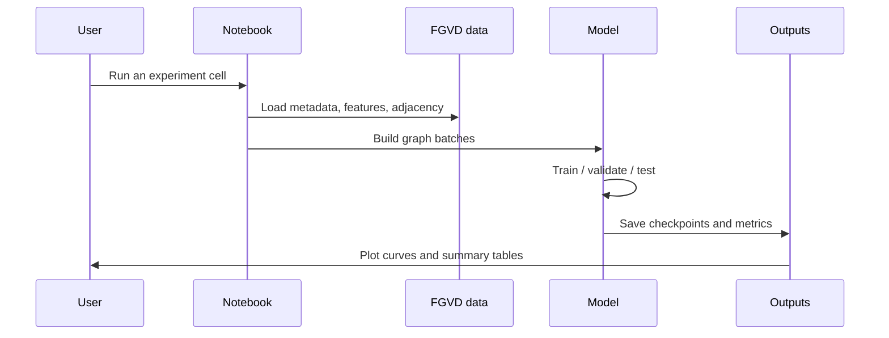

# FGVD Graph Classification Notebook Suite

This repository contains the notebooks, assets, and experiments used for the FGVD vehicle classification project based on the paper **Graph-Based Two-Three Wheeler Classification in Unconstrained Indian Roads**.

The goal is to reproduce and compare graph-based and classical baselines across the paper's label hierarchy:

- L1: vehicle type
- L2: manufacturer
- L3: model

## Notebook Map

The workspace is organized around multiple experiment variants:

- [sgcn.ipynb](sgcn.ipynb) - SGCN experiments and paper-style multi-level runs
- [sgcn_df.ipynb](sgcn_df.ipynb) - deep-feature SGCN variant
- [gat.ipynb](gat.ipynb) - GAT-based experiments
- [rf.ipynb](rf.ipynb) - Random Forest baseline

## Project View





## What Is Included

- Notebook implementations for graph-based and classical baselines
- FGVD handover metadata and graph adjacency files
- Optional raw and deep feature folders for different model variants
- Saved checkpoints and plots generated during training
- A Git-friendly top-level README and ignore rules for generated artifacts

## Repository Layout

```text
FGVD_Graph_Handover/
  metadata.csv
  master_grid_adj.npz
  raw_features/
  deep_features/
  per_sample_adj/

checkpoints/
plots/
data/
gat.ipynb
rf.ipynb
sgcn.ipynb
sgcn_df.ipynb
README.md
```

## Visuals

The repository already contains result figures that are useful for a quick glance at training behavior and baseline comparisons.

### SGCN Learning Curves


This plot shows the training and validation loss/accuracy trends for the SGCN L1 all-class experiment.

### Random Forest Comparison


This figure compares validation and test accuracy, along with macro-F1, across the Random Forest experiments.

## Important Note on Git Uploads

The `.gitignore` is configured so the repository can be pushed to Git without dragging in large or generated artifacts such as:

- Python virtual environments
- Notebook cache files
- Training checkpoints
- Plot outputs
- Raw image folders and large generated feature directories

That keeps the git history small while preserving the notebooks and the essential project files.

## Data and Feature Usage

The project supports two common modes:

- **Raw-feature SGCN pipeline**: uses the handcrafted graph features stored under `FGVD_Graph_Handover/raw_features/`
- **Deep-feature pipeline**: uses the learned features stored under `FGVD_Graph_Handover/deep_features/`

The main notebook in this repo can be configured for paper-style multi-level evaluation across L1, L2, and L3. Check the notebook cell comments for the exact feature policy used in each run.

## Quick Start

1. Create and activate a Python environment.
2. Install the required packages used by the notebooks, including PyTorch, PyTorch Geometric, NumPy, Pandas, SciPy, scikit-learn, and Matplotlib.
3. Open the notebook you want to run.
4. Ensure the FGVD files are present in the expected directories.
5. Execute the training cell for the experiment you want.

## Expected Inputs

The notebooks expect the following files and folders to exist:

- `FGVD_Graph_Handover/metadata.csv`
- `FGVD_Graph_Handover/master_grid_adj.npz`
- `FGVD_Graph_Handover/raw_features/` and/or `FGVD_Graph_Handover/deep_features/`
- `data/raw/images/` if you are regenerating crops or detections

## Outputs

Training runs typically write to:

- `checkpoints/`
- `plots/`

These paths are ignored by git by default so repeated experiments do not clutter the repository.

## Reproducibility

Most notebooks set a fixed seed and use the train/validation/test split already provided in `metadata.csv`. If you rerun experiments, keep the same split files and feature directories to reproduce comparable results.

## Notes

- Keep the notebooks in sync with the data layout before running long experiments.
- If you want a fully clean upload, commit the notebooks, metadata, and lightweight configuration files, but leave generated checkpoints and outputs untracked.
- The top-level `README(1).md` is a longer project note; this `README.md` is the recommended entry point for GitHub.