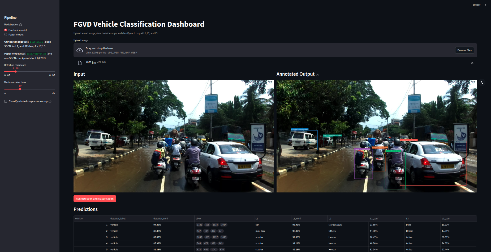
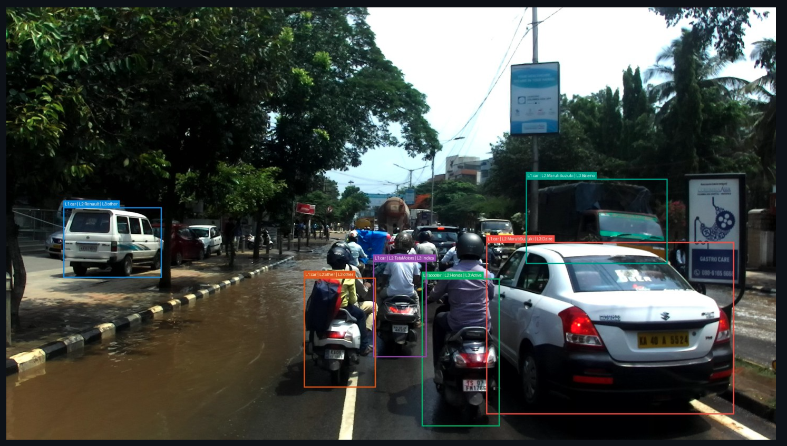
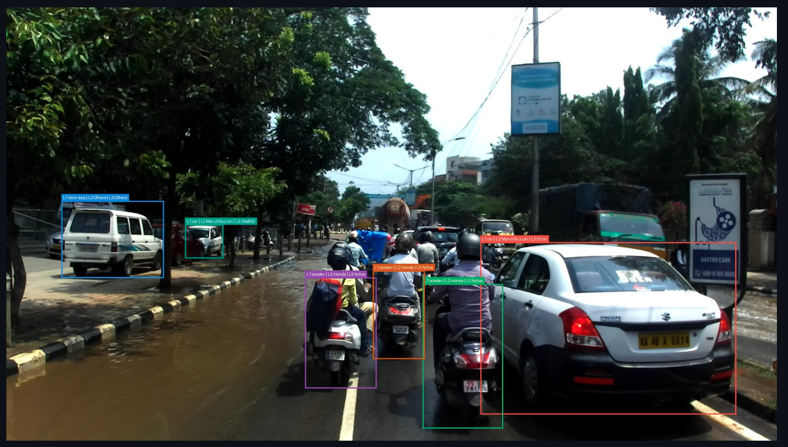
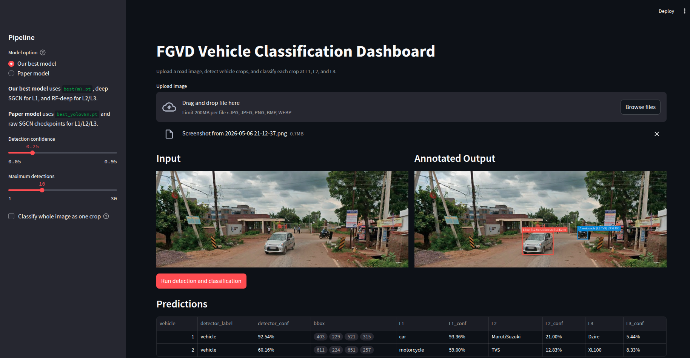

# FGVD Dashboard

Run from the project root:

```bash
pip install -r dashboard/requirements.txt
python -m streamlit run dashboard/app.py
```

## Screenshots

### Real-time dashboard



### Paper model



### Our best model



### Trial run



## Model Options

The app has two model options:

- `Our best model`: `dashboard/detection/best(m).pt` + improved deep SGCN classification checkpoints.
- `Paper model`: `dashboard/detection/best_yolov8n.pt` + paper-based raw SGCN classification checkpoints.

YOLO detector mode is enabled when the dashboard dependencies are installed. If `ultralytics` is unavailable, the app falls back to whole-image classification so cropped-vehicle testing still works.

Inference uses a hierarchical cascade: L1 is predicted first, L2 is restricted to labels under that L1 parent, and L3 is restricted under the selected L2 parent. Displayed confidences remain the model's original probabilities, so a forced one-child subtree does not become a misleading 100%. The dashboard also normalizes Gabor/Sobel crop features to the same 0-1 scale used by the training feature files and uses the training Gabor setting `sigma = lambda / pi`.
